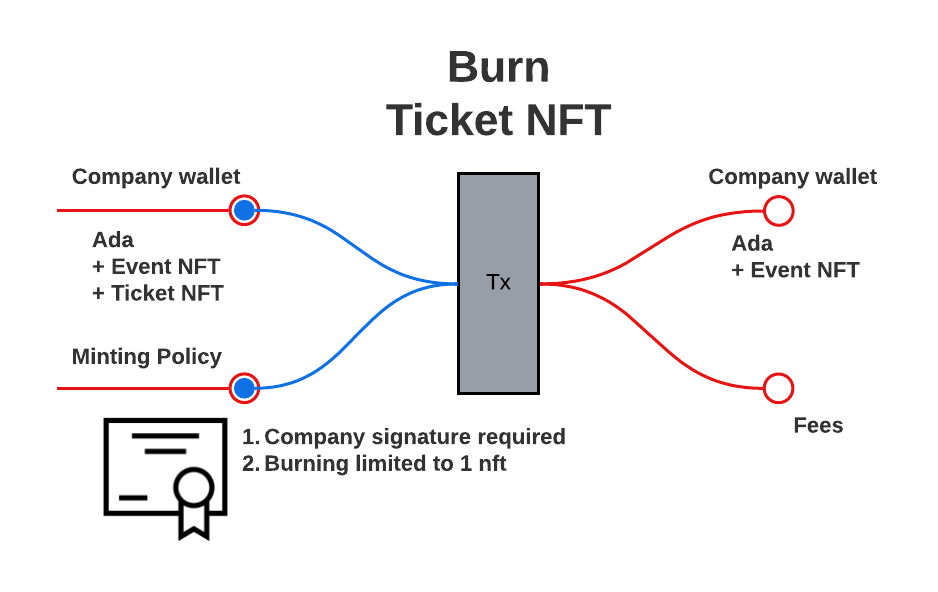

# Decentralized Tix

Decentalized Tix is a prototype for selling tickets using the blockchain. 

## User Flow Process

When a user creates an account, the company [mint](#mint-user-token)s and issues the user a user token. The user token allows for ticket purchasing. The company also [mint](#mint-ticket-creator-nft)s a ticket creator NFT. The ticket creator NFT allows the holder to mint tickets for a particular event. Once a ticket is [mint](#mint-ticket-nft)ed, the ticket is sent to a vesting script address. The vesting script allows a user token holder to [purchase](#purchase-ticket-nft-from-script-address-purchase-ticket-nft) a ticket NFT, on a specified date, for a set price of 6₳.

---

### Policies

#### Generate user token Plutus file

```haskell
--                pkh
saveUserPolicy :: PubKeyHash -> IO ()
```

Notes

> **pkh**: pubKeyHash required to mint the user token, 
> - company pubKeyHash

```bash
root@cd18371d4d13:/workspace/code/DecentralizedTix# cabal repl
Prelude Main>:l User
Prelude User>:set -XOverloadedStrings
Prelude User>saveUserPolicy "a71860d5e0b35967e9218a49d227cc460a1ee5b2d86f7d6cfb051ba9"
```

#### Mint user token


##### API
```
script: scripts/user/mint.sh
params: 
  USER=$1            # who's paying for tx?
  PAYMENT_UTXO=$2    # how are they paying?
  COLLATERAL=$3      # collateral utxo
```

##### Example
```
root@cd18371d4d13:scripts/user/mint.sh \    
>   user2 \
>   6595da6ca09de972f8d79ccee73a17bdd186e37f5d7005c9d23b57be0996a80c#1 \
>   e9c729d97cdbaafd0b410ad6078f6facb3dd93a7a74a3c5e3f1edcc5570acc4b#1
```

#### Burn user token


##### API
```
script: scripts/user/burn.sh
params:
  USER=$1            # who's paying for tx?
  PAYMENT_UTXO=$2    # how are they paying?
  NFT_UTXO=$3        # utxo to consume (contains NFT)
  COLLATERAL=$4      # collateral utxo
```

##### Example
```
root@cd18371d4d13:scripts/user/burn.sh \
>   user2 \
>   5824420e21b91cf0c015a37678eacf9137494580defc9b604c8aec334ffb4bc5#1 \
>   5824420e21b91cf0c015a37678eacf9137494580defc9b604c8aec334ffb4bc5#0 \
>   e9c729d97cdbaafd0b410ad6078f6facb3dd93a7a74a3c5e3f1edcc5570acc4b#1
```

---

### Ticket Creator NFT

#### Generate ticket creator NFT Plutus file

```haskell
--               pkh           oref        tn
saveNFTPolicy :: PubKeyHash -> TxOutRef -> TokenName -> IO ()
```

Notes:

> **pkh**: pubKeyHash required to mint the ticket creator NFT, in this case...the company's pubKeyHash

> **oref**: utxo to consume

> **tn**: ticket token name

```bash
root@cd18371d4d13:/workspace/code/DecentralizedTix# cabal repl
Prelude Main>:l TicketCreatorNFT
Prelude TicketCreatorNFT>:set -XOverloadedStrings
Prelude TicketCreatorNFT>import Plutus.V2.Ledger.Api
Prelude TicketCreatorNFT>saveNFTPolicy "a71860d5e0b35967e9218a49d227cc460a1ee5b2d86f7d6cfb051ba9" (TxOutRef "2712f66819ac7f52683ee7e97e6878263dfaa42c85dde8ed23097ce461d5ab85" 0) "Ticket Creator"
```
#### Mint ticket creator NFT


##### API
```
script: scripts/script: scripts/ticketCreator/mint.sh
params: 
  USER=$1            # who's paying for tx?
  PAYMENT_UTXO=$2    # how are they paying?
  COLLATERAL=$3      # collateral utxo
```

##### Example
```
root@cd18371d4d13:scripts/ticketCreator/mint.sh \    
>   company \
>   2712f66819ac7f52683ee7e97e6878263dfaa42c85dde8ed23097ce461d5ab85#0 \
>   f8d4d6b984a1b348bbb198b6a25eceeded9b516fc50b676b7912c5582ba73534#0
```

#### Burn ticket creator NFT


##### API
```
script: scripts/ticketCreator/burn.sh
params:
  USER=$1            # who's paying for tx?
  PAYMENT_UTXO=$2    # how are they paying?
  NFT_UTXO=$3        # utxo to consume (contains NFT)
  COLLATERAL=$4      # collateral utxo
  MINT_UTXO=$5       # utxo used in ticket creator minting process
```

##### Example
```
root@cd18371d4d13:scripts/ticketCreator/burn.sh \
>   company \
>   081386b2ac4c2f103ec38fd26a52ca50536a043508dce2af5460cf45bed88402#0 \
>   f6793c54e757dc790837ff1b0c0c6bafa9fc11d228ee779762c5205ca7001ebe#0 \
>   f8d4d6b984a1b348bbb198b6a25eceeded9b516fc50b676b7912c5582ba73534#0 \
>   2712f66819ac7f52683ee7e97e6878263dfaa42c85dde8ed23097ce461d5ab85#0
```

---

### Ticket NFT

#### Generate ticket NFT Plutus file

```haskell
--               ac            oref       tn
saveNFTPolicy :: AssetClass -> TxOutRef -> TokenName -> IO ()
```

Notes:

> **ac**: asset class permitted to mint ticket NFT
> - event ticket creator NFT asset class

> **oref**: utxo to consume

> **tn**: ticket token name

```
root@cd18371d4d13:/workspace/code/DecentralizedTix# cabal repl
Prelude Main>:l TicketNFT
Prelude TicketNFT>:set -XOverloadedStrings
Prelude TicketNFT>import Plutus.V2.Ledger.Api
Prelude TicketNFT>saveNFTPolicy (assetClass "47bfc748891f37b9d47cdbb8ff0ddf73df70f4a5ea22417a19ddc46a" "Ticket Creator") (TxOutRef "dba94941278a873efd7ea4ed3855e5a21118050923e011917d71e64ddc8bdaa2" 0) "Ticket"
```
#### Mint ticket NFT


##### API
```
script: scripts/ticket/mint.sh
params: 
  USER=$1            # who's paying for tx?
  PAYMENT_UTXO=$2    # how are they paying?
  COLLATERAL=$3      # collateral utxo
  TC_NFT_UTXO=$4     # utxo to consume (contains ticket creator NFT)
  TC_MINT_UTXO=$5    # utxo used in ticket creator minting process
  DEADLINE=$6        # date ticket is available for purchase
```

##### Example
```
root@cd18371d4d13:scripts/ticket/mint.sh \
>   company \
>   dba94941278a873efd7ea4ed3855e5a21118050923e011917d71e64ddc8bdaa2#0 \
>   f8d4d6b984a1b348bbb198b6a25eceeded9b516fc50b676b7912c5582ba73534#0 \
>   c617dc89b02c07eb5fe8c76405094ed98dbea9969938fe7085992fcb0a025108#1 \
>   2712f66819ac7f52683ee7e97e6878263dfaa42c85dde8ed23097ce461d5ab85#0 \
>   1681245690
```
#### Burn ticket NFT


##### API
```
script: scripts/ticket/burn.sh
params: 
  USER=$1            # who's paying for tx?
  PAYMENT_UTXO=$2    # how are they paying?
  COLLATERAL=$3      # collateral utxo
  TC_NFT_UTXO=$4     # utxo to consume (contains ticket creator NFT)
  TC_MINT_UTXO=$5    # utxo used in ticket creator minting process
  DEADLINE=$6        # date ticket is available for purchase
```

##### Example
```
root@cd18371d4d13:scripts/ticket/burn.sh \
>   user2 \
>   10dc49f05c02027d346ee7e00c35888f1d89b8d9632a39f6d5ab896576576e0b#2 \
>   10dc49f05c02027d346ee7e00c35888f1d89b8d9632a39f6d5ab896576576e0b#1 \
>   e9c729d97cdbaafd0b410ad6078f6facb3dd93a7a74a3c5e3f1edcc5570acc4b#1 \
>   c175e76b6f15b0c2e2df10d420ebb1a326bc324638b2f8ef01c381284cb44dff#0 \
>   2712f66819ac7f52683ee7e97e6878263dfaa42c85dde8ed23097ce461d5ab85#0
```

---

### Smart Contract

#### Vesting

##### Generate vesting Plutus file
```haskell
--         ac            params
saveVal :: AssetClass -> VestingParams -> IO ()
```

Notes:

> **ac**: asset class required to purchase ticket NFT,
> - user token asset class

```haskell
data VestingParams = VestingParams
  { beneficiary :: PubKeyHash
  , deadline    :: POSIXTime
  }
```

> **beneficiary**: the beneficiary's pubKeyHash
> - company pubKeyHash

> **deadline**: the posix time when the ticket becomes available

```
root@cd18371d4d13:/workspace/code/DecentralizedTix# cabal repl
Prelude Main>:l Vesting
Prelude Vesting>:set -XOverloadedStrings
Prelude Vesting>import Plutus.V2.Ledger.Api
Prelude Vesting>saveVal (assetClass "170e169de9dc68629af74abdec8cb391377ff7a8034ff23ac5f6793d" "User") (VestingParams "a71860d5e0b35967e9218a49d227cc460a1ee5b2d86f7d6cfb051ba9" 1681245690)
```

##### Purchase ticket NFT from script address


###### API
```
script: scripts/vesting/purchase.sh
params:
  USER=$1            # who's paying for tx?
  PAYMENT_UTXO=$2    # how are they paying?
  TICKET_NFT_UTXO    # utxo used in ticket minting process
  TC_MINT_UTXO=$4    # utxo used in ticket creator minting process
  DEADLINE=$5        # date ticket is available for purchase
```

###### Example
```
root@cd18371d4d13:scripts/vesting/purchase.sh \ 
>   user2 \
>   eeafcf73fedc680df20f3e896ae48b380539d7da297e52f0eb8c9f3beca4ee73#1 \
>   eeafcf73fedc680df20f3e896ae48b380539d7da297e52f0eb8c9f3beca4ee73#0 \
>   b1059558a3afacd1befc22dd8ab855d4b974fdccab916f07cd375a7147877642#1 \
>   e9c729d97cdbaafd0b410ad6078f6facb3dd93a7a74a3c5e3f1edcc5570acc4b#1 \
>   14679465 \
>   dba94941278a873efd7ea4ed3855e5a21118050923e011917d71e64ddc8bdaa2#0 \
>   2712f66819ac7f52683ee7e97e6878263dfaa42c85dde8ed23097ce461d5ab85#0 \
>   1681245690
```

##### Send ticket NFT to script address
Utility function: moves the ticket NFT from user wallet to script address. 
> No diagram provided.

###### API
```
script: scripts/vesting/give.sh
params:
  USER=$1              # who's paying for tx?
  PAYMENT_UTXO=$2      # how are they paying?
  TICKET_NFT_UTXO=$3   # utxo to consume (contains user token)
  TC_NFT_UTXO=$4       # utxo used in ticket minting process
  TC_MINT_UTXO=$5      # utxo used in ticket creator minting process
  DEADLINE=$6          # date ticket is available for purchase
```

###### Example
```
root@cd18371d4d13:scripts/vesting/give.sh \  
>   user2 \
>   0c22bd4c5784398c07f74aeb92f0a4a34788a9e090d96686c20166c11c4cee90#3 \
>   0c22bd4c5784398c07f74aeb92f0a4a34788a9e090d96686c20166c11c4cee90#2 \
>   dba94941278a873efd7ea4ed3855e5a21118050923e011917d71e64ddc8bdaa2#0 \
>   2712f66819ac7f52683ee7e97e6878263dfaa42c85dde8ed23097ce461d5ab85#0 \
>   1681245690
```

---

### Demo