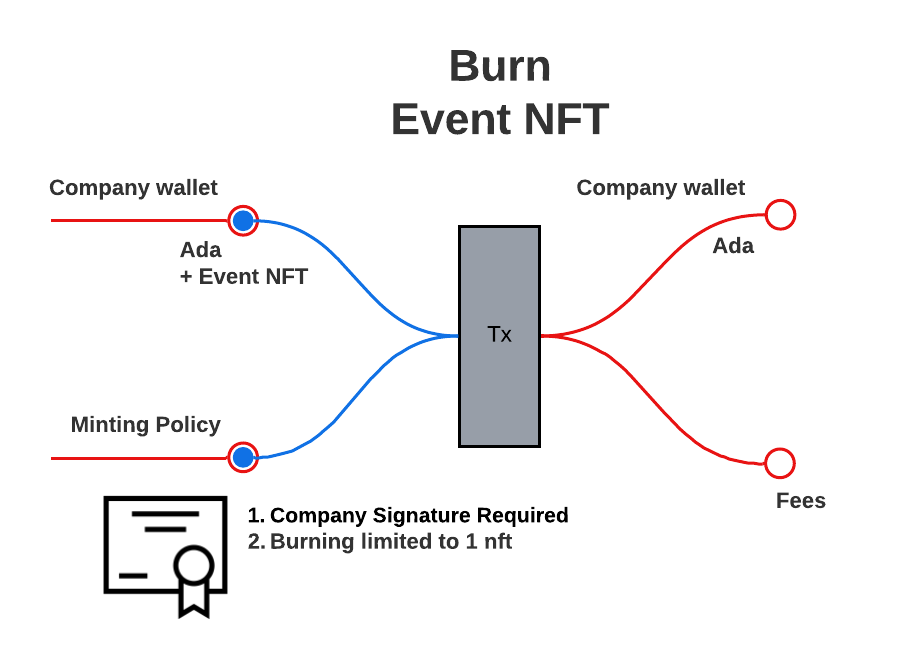
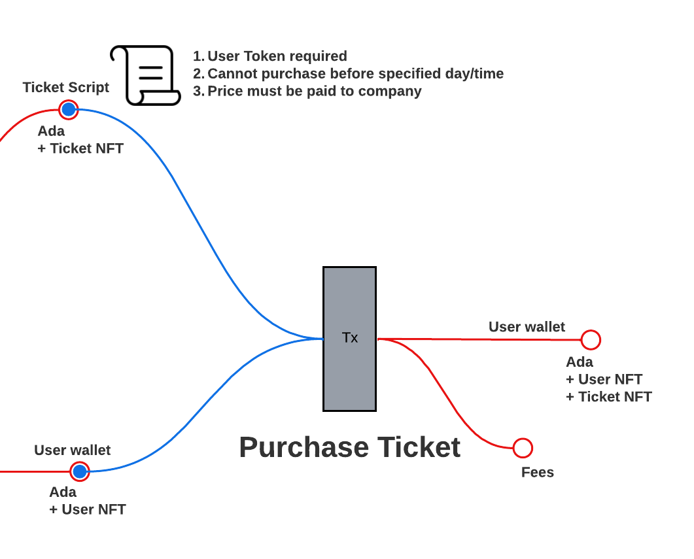

# Decentralized Tix

Decentalized Tix is a prototype for an event ticketing system using the blockchain. 

## User Flow Process

1. The company [mint](#mint-event-nft)s an event NFT. 
2. The event NFT allows the holder to mint tickets for a particular event. Once a ticket is [mint](#mint-ticket-nft)ed, the ticket is sent to a vesting script address.
3. A user token is [mint](#mint-user-token)ed, upon user account creation. 
4. Tickets may be [purchase](#purchase-ticket-nft-from-script-address)d by user token holders.

---

### Event NFT

#### Generate event NFT Plutus file

```haskell
--               artist               startTime    pkh           oref        tn
saveNFTPolicy :: BuiltinByteString -> POSIXTime -> PubKeyHash -> TxOutRef -> TokenName -> IO ()
```

Notes:

> **artist**: artist name

> **startTime**: event start time

> **pkh**: company's pubKeyHash is required to mint/burn the event NFT

> **oref**: utxo to consume

> **tn**: event token name

```bash
root@cd18371d4d13:/workspace/code/DecentralizedTix# cabal repl
Prelude Main>:l TicketCreatorNFT
Prelude TicketCreatorNFT>:set -XOverloadedStrings
Prelude TicketCreatorNFT>import Plutus.V2.Ledger.Api
Prelude Plutus.V2.Ledger.Api TicketCreatorNFT>saveNFTPolicy "Taylor Swift" 1683453600000 "0c0a582ed7626ef6df14d295c7bbdf225c123b3916fa97ccd5d4761d" (TxOutRef "a06d46e6bea9bc5a0b499e5a83d585aa1d1875d8d242b9dcfffb535131272c04" 1) "Event"
```
#### Mint event NFT


##### API
```
script: scripts/event/mint.sh
params: 
  USER=$1            # who's paying for tx?
  PAYMENT_UTXO=$2    # how are they paying?
  COLLATERAL=$3      # collateral utxo
  ARTIST=$4          # artist
  START_TIME=$5      # start time
```

##### Example
```
root@cd18371d4d13:scripts/event/mint.sh \    
>   decentralized-tix \
>   a06d46e6bea9bc5a0b499e5a83d585aa1d1875d8d242b9dcfffb535131272c04#1 \
>   b005e6b2af2ca57ae5a7ea74cbc96c8e9986100a45e92fe77a82f5f0c008a51e#1 \
>   "Taylor Swift" \
>   1683453600000
```

#### Burn event NFT


##### API
```
script: scripts/event/burn.sh
params:
  USER=$1            # who's paying for tx?
  PAYMENT_UTXO=$2    # how are they paying?
  NFT_UTXO=$3        # utxo to consume (contains event NFT)
  COLLATERAL=$4      # collateral utxo
  MINT_UTXO=$5       # utxo used in event minting process
  ARTIST=$6          # artist
  START_TIME=$7      # start time
```

##### Example
```
root@cd18371d4d13:scripts/event/burn.sh \
>   decentralized-tix \
>   d987efa5642454564f72ae45203bc4647eede2a2f21160ed965efedde873c4d4#1 \
>   d987efa5642454564f72ae45203bc4647eede2a2f21160ed965efedde873c4d4#0 \
>   b005e6b2af2ca57ae5a7ea74cbc96c8e9986100a45e92fe77a82f5f0c008a51e#1 \
>   a06d46e6bea9bc5a0b499e5a83d585aa1d1875d8d242b9dcfffb535131272c04#1 \
>   "Taylor Swift" \
>   1683453600000
```

---

### Ticket NFT

#### Generate ticket NFT Plutus file

```haskell
--               seat       ac            oref        tn
saveNFTPolicy :: Integer -> AssetClass -> TxOutRef -> TokenName -> IO ()
```

Notes:

> **seat**: seat number

> **ac**: asset class permitted to mint ticket NFT
> - event NFT asset class

> **oref**: utxo to consume

> **tn**: ticket token name
```
root@cd18371d4d13:/workspace/code/DecentralizedTix# cabal repl
Prelude Main> :l TicketNFT
Prelude TicketNFT> :set -XOverloadedStrings
Prelude TicketNFT> import Plutus.V1.Ledger.Value 
Prelude Plutus.V1.Ledger.Value TicketNFT> import Plutus.V2.Ledger.Api
Prelude Plutus.V1.Ledger.Value Plutus.V2.Ledger.Api TicketNFT> saveNFTPolicy 1 (assetClass "9eb68eebcd581173be67061f783231d8703c0dc9c3597abf3c28a42b" "Event") (TxOutRef "a7c8ff8bcd808cf6ccbd90ab0ccb3ede9edc11dc1928fa719908f7a4bbb7e928" 1) "Ticket"
```
#### Mint ticket NFT


##### API
```
script: scripts/ticket/mint.sh
params: 
  USER=$1               # who's paying for tx?
  PAYMENT_UTXO=$2       # how are they paying?
  COLLATERAL=$3         # collateral utxo
  EVENT_NFT_UTXO=$4     # utxo containing event NFT
  EVENT_MINT_UTXO=$5    # utxo used in event minting process
  ARTIST=$6             # artist
  START_TIME=$7         # start time
  SEAT=$8               # seat number
```

##### Example
```
root@cd18371d4d13:scripts/ticket/mint.sh \
>   decentralized-tix \
>   b2cff6052079401029b0dfe222944de2c713f7935e7d041ee056b66a2e4891f2#2 \
>   b005e6b2af2ca57ae5a7ea74cbc96c8e9986100a45e92fe77a82f5f0c008a51e#1 \
>   b2cff6052079401029b0dfe222944de2c713f7935e7d041ee056b66a2e4891f2#1 \
>   2a6cdaeccfb529959858048efb0f7230beda3a928d929112f2baf5a59b89e6d8#1 \
>   "Taylor Swift" \
>   1683453600000 \
>   1
```
#### Burn ticket NFT


##### API
```
script: scripts/ticket/burn.sh
params: 
  USER=$1               # who's paying for tx?
  PAYMENT_UTXO=$2       # how are they paying?
  NFT_UTXO=$3           # utxo to consume (contains ticket NFT)
  COLLATERAL=$4         # collateral utxo
  EVENT_NFT_UTXO=$5     # utxo to consume (contains event NFT)
  TICKET_MINT_UTXO=$6   # utxo used in ticket minting process
  EVENT_MINT_UTXO=$7    # utxo used in event minting process
  ARTIST=$8             # artist
  START_TIME=$9         # start time
  SEAT=${10}            # seat number
```

##### Example
```
root@cd18371d4d13:scripts/ticket/burn.sh \
>   decentralized-tix \
>   faddbde4c43690fa04967b38e80de0e57ccf7e54f580470da299177a1cde4efa#2 \
>   faddbde4c43690fa04967b38e80de0e57ccf7e54f580470da299177a1cde4efa#0 \
>   b005e6b2af2ca57ae5a7ea74cbc96c8e9986100a45e92fe77a82f5f0c008a51e#1 \
>   faddbde4c43690fa04967b38e80de0e57ccf7e54f580470da299177a1cde4efa#1 \
>   a7c8ff8bcd808cf6ccbd90ab0ccb3ede9edc11dc1928fa719908f7a4bbb7e928#1 \
>   2a6cdaeccfb529959858048efb0f7230beda3a928d929112f2baf5a59b89e6d8#1 \
>   "Taylor Swift" \
>   1683453600000 \
>   1
```

---

### User Token

#### Generate user token Plutus file

```haskell
--                pkh
saveUserPolicy :: PubKeyHash -> IO ()
```

Notes

> **pkh**: pubKeyHash required to mint/burn the user token, 
> - company pubKeyHash

```bash
root@cd18371d4d13:/workspace/code/DecentralizedTix# cabal repl
Prelude Main>:l User
Prelude User>:set -XOverloadedStrings
Prelude User>saveUserPolicy "a71860d5e0b35967e9218a49d227cc460a1ee5b2d86f7d6cfb051ba9"
```

#### Mint user token


##### API
```
script: scripts/user/mint.sh
params: 
  USER=$1            # who's paying for tx?
  PAYMENT_UTXO=$2    # how are they paying?
  COLLATERAL=$3      # collateral utxo
```

##### Example
```
root@cd18371d4d13:scripts/user/mint.sh \    
>   user2 \
>   6595da6ca09de972f8d79ccee73a17bdd186e37f5d7005c9d23b57be0996a80c#1 \
>   e9c729d97cdbaafd0b410ad6078f6facb3dd93a7a74a3c5e3f1edcc5570acc4b#1
```

#### Burn user token


##### API
```
script: scripts/user/burn.sh
params:
  USER=$1            # who's paying for tx?
  PAYMENT_UTXO=$2    # how are they paying?
  NFT_UTXO=$3        # utxo to consume (contains user token)
  COLLATERAL=$4      # collateral utxo
```

##### Example
```
root@cd18371d4d13:scripts/user/burn.sh \
>   user2 \
>   5824420e21b91cf0c015a37678eacf9137494580defc9b604c8aec334ffb4bc5#1 \
>   5824420e21b91cf0c015a37678eacf9137494580defc9b604c8aec334ffb4bc5#0 \
>   e9c729d97cdbaafd0b410ad6078f6facb3dd93a7a74a3c5e3f1edcc5570acc4b#1
```

---

### Vesting Smart Contract

#### Vesting

##### Generate vesting Plutus file
```haskell
--         ac
saveVal :: AssetClass -> IO ()
```

Notes:

> **ac**: asset class required to purchase ticket NFT,
> - user token asset class
```
root@cd18371d4d13:/workspace/code/DecentralizedTix# cabal repl
Prelude Main>:l ParameterizedVesting
Prelude ParameterizedVesting>:set -XOverloadedStrings
Prelude ParameterizedVesting>import Plutus.V2.Ledger.Api
Prelude ParameterizedVesting>saveVal (assetClass "170e169de9dc68629af74abdec8cb391377ff7a8034ff23ac5f6793d" "User")
```

##### Purchase ticket NFT from script address


###### API
```
script: scripts/vesting/purchase.sh
params:
  USER=$1               # who's paying for tx?
  PAYMENT_UTXO=$2       # how are they paying?
  VESTED_UTXO=$3        # utxo containing ticket NFT
  USER_TOKEN_UTXO=$4    # utxo containing user token
  COLLATERAL=$5         # collateral utxo
  SLOT=$6               # current slot
  TICKET_MINT_UTXO=$7   # utxo used in ticket minting process
  EVENT_NFT_UTXO=$8     # utxo containing event NFT
  EVENT_MINT_UTXO=$9    # utxo used in event minting process
  ARTIST=${10}          # artist
  START_TIME=${11}      # start time
  SEAT=${12}            # seat number
```

###### Example
```
root@cd18371d4d13:scripts/vesting/purchase.sh \ 
>   user3 \
>   c42cd4d69e9322628bcb52ba63d1ba1c03e04e61b1e7728278ec82e3e73e1286#1 \
>   c42cd4d69e9322628bcb52ba63d1ba1c03e04e61b1e7728278ec82e3e73e1286#0 \
>   566c4c9746e6fbb221f48632e010c0ab6aa5a39e320ce9493df54a8dbf4bb087#1 \
>   a1680b604dd117569626c60a3fcd8842a736777bc1da820088b0d87012106198#1 \
>   14679465 \
>   b2cff6052079401029b0dfe222944de2c713f7935e7d041ee056b66a2e4891f2#2 \
>   c18a7b9d8ebffcafb744791799dd1cf6a83c6635d0e2136efa70c83aef14cca1#1 \
>   2a6cdaeccfb529959858048efb0f7230beda3a928d929112f2baf5a59b89e6d8#1 \
>   "Taylor Swift" \
>   1683453600000 \
>   1
```

##### Send ticket NFT to script address
Utility function: moves the ticket NFT from user wallet to script address. 
> No diagram provided.

###### API
```
script: scripts/vesting/give.sh
params:
  USER=$1               # who's paying for tx?
  PAYMENT_UTXO=$2       # how are they paying?
  TICKET_NFT_UTXO=$3    # utxo containing user token
  EVENT_NFT_UTXO=$4     # utxo containing event NFT
  EVENT_MINT_UTXO=$5    # utxo used in event minting process
  ARTIST=$6             # artist
  START_TIME=$7         # start time
  SEAT=$8               # seat number
```

###### Example
```
root@cd18371d4d13:scripts/vesting/give.sh \  
>   user3 \
>   b529d5c5ecaf5bef43167d9d752e1003c93adcbddfdbfbb5679c98cf5fe2c578#1 \
>   b11def2be91eb1e34c8ff6745245cf77be4036c3d349b01908a15c2d07134586#2 \
>   b2cff6052079401029b0dfe222944de2c713f7935e7d041ee056b66a2e4891f2#2 \
>   2a6cdaeccfb529959858048efb0f7230beda3a928d929112f2baf5a59b89e6d8#1 \
>   "Taylor Swift" \
>   1683453600000 \
>   1
```

---

### Demo